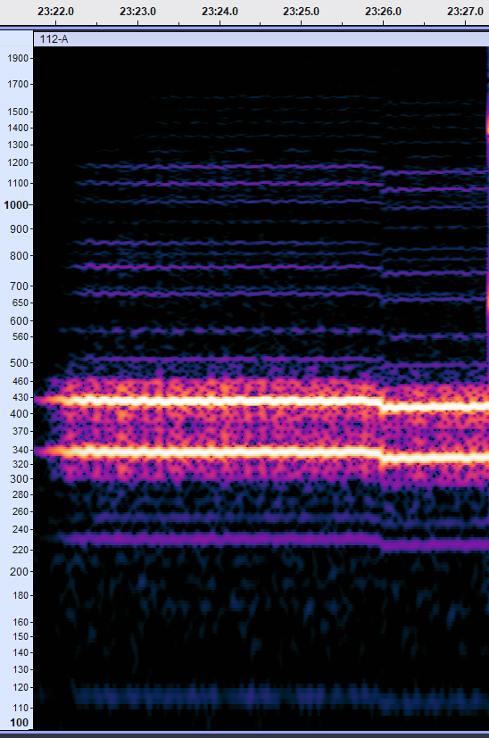

# 
Band pass filter with frequencies from 215 Hz to 240 Hz.

# Reference pitch

At one point in one of the recordings, a US [dial tone](https://en.wikipedia.org/wiki/Dial_tone) is present alongside the hum.  Assuming the hum speeds up and slows down with the rest of the audio (which I have not proven), I should be able to use this as a reference.  The North American dial tone is a combination of 350 Hz and 440 Hz.

| Hum #1 | Hum #2 | Dial Tone (350 Hz) | Dial Tone (440 Hz) | Notes |
| :-- | :-- | :-- | :-- | :-- |
| 113 Hz | 227 Hz | 332 Hz | 416 Hz | First instance in 112-A. |
| 115 Hz | 230 Hz | 338 Hz | 423 Hz | First half of second instance in 112-A. |
| 112 Hz | 219 Hz | 322 Hz | 413 Hz | Second half of second instance in 112-A. |

Based on this, I'm going to conclude that these hum frequencies should be 120 Hz and 240 Hz.  Given that the AC power is 60 Hz, that would make sense.  There are several harmonics.

